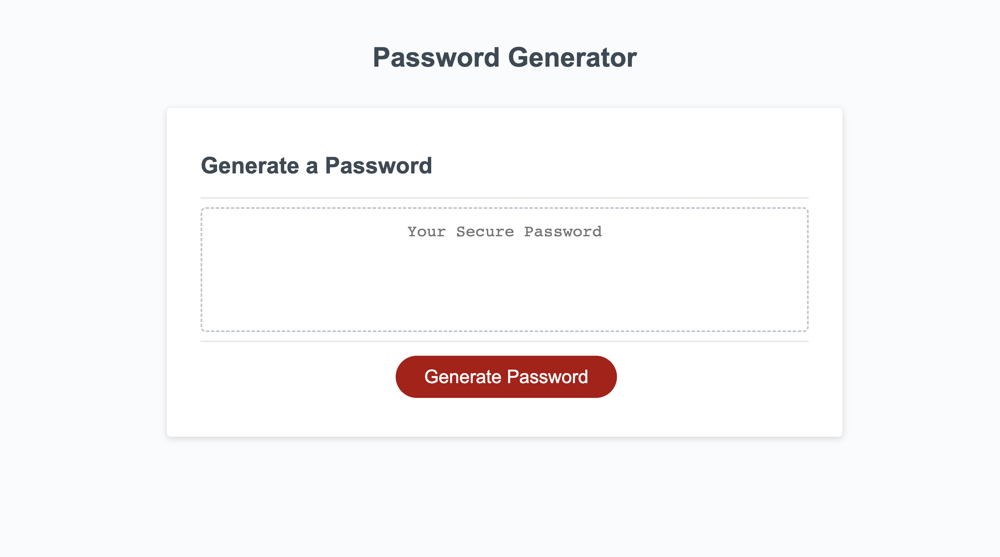
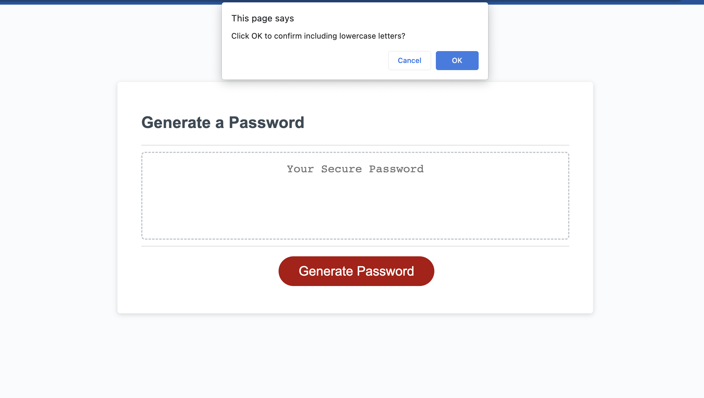
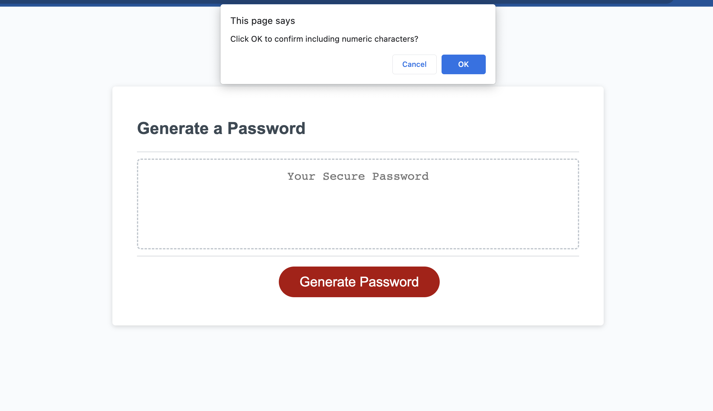
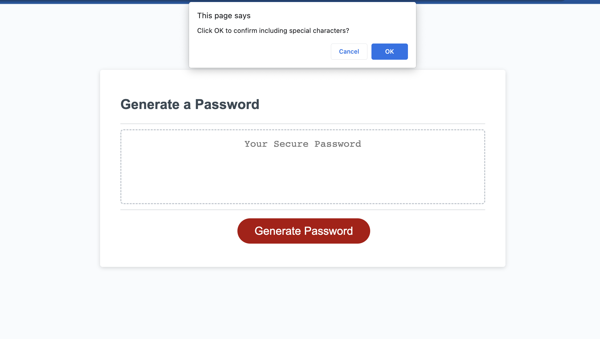
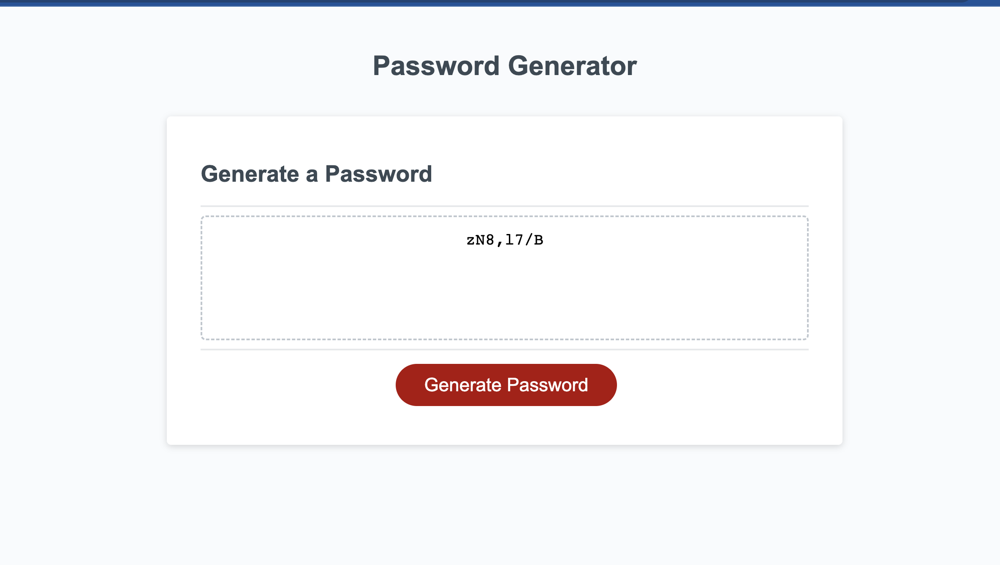
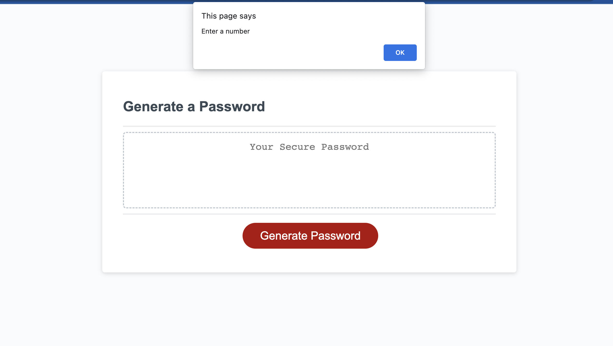
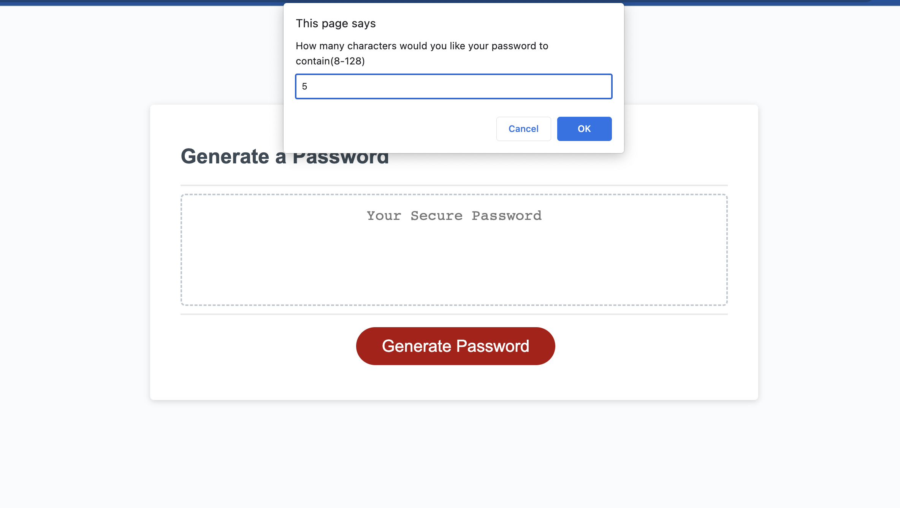
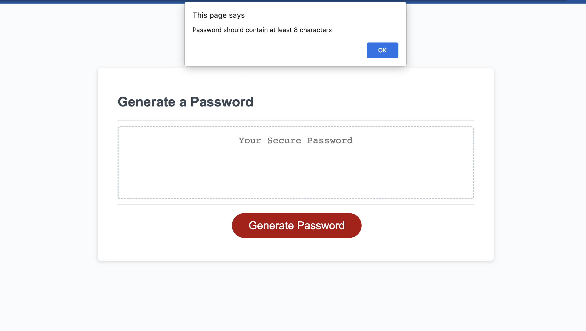
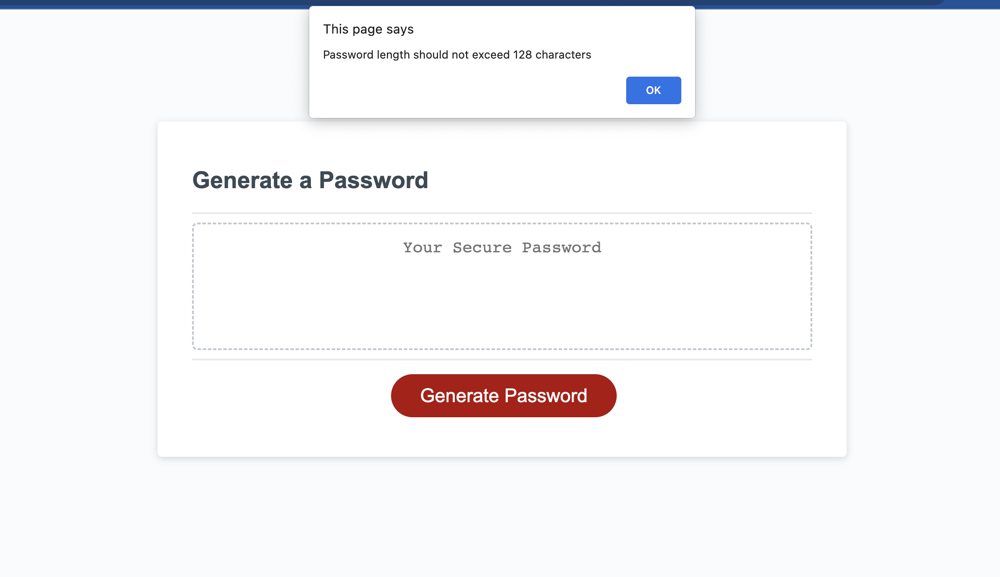
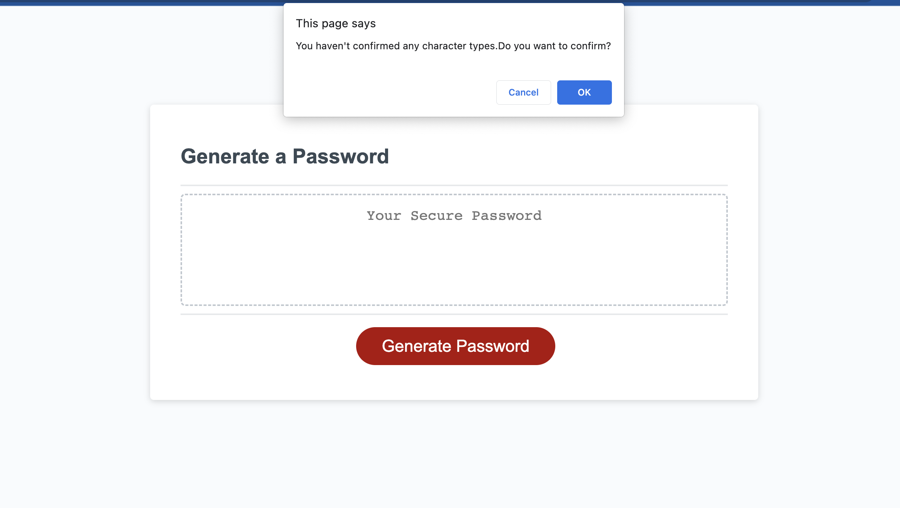

# Password Generator Webpage

## Description

This application helps user to generate a random password. Users are prompted to answer a sequence of questions to make sure the password generated conform to the criteria. The password criteria are
   - The length of the password should be at least 8 characters and no more than 128 characters.
   - whether or not to include lowercase, uppercase, numeric, and/or special characters.
   - At least one of the character types should be confirmed.
To make the password more secure the application makes sure that a random character is selected from each of the types user confirmed.   

## Installation

N/A

## Usage

 The user is presented with a placeholder for the new password and a button to click to generate a password when the application is opened. Up on clicking the button the user will be prompted with certain questions to confirm. Initially it asks for the number of characters to include in the password. User is allowed to enter a number between 8 to 128 . Then a series of confirmations have to be done to select the character types that has to be included in the password. Depending on the selected criteria a random password will be generated and displayed in the placeholder. If the entered password length is less than 8 or greater than 128 then an alert will be displayed asking the user to enter right number. Similarly if the user doesn't include any of the character types then another confirmation message will be displayed to continue or not.

The following images show the web application's appearance and functionality   :

Validation

Link to website  :

https://shimna-puthanayil.github.io/password-generator/

## Credits

Code in line numbers 51 and 125 in script.js has been copied from stack overflow.
https://stackoverflow.com/questions/4550505/getting-a-random-value-from-a-javascript-array

References

https://developer.mozilla.org/en-US/docs/Web/JavaScript/Reference/Global_Objects/NaN

https://developer.mozilla.org/en-US/docs/Web/JavaScript/Reference/Global_Objects/Array

## License

MIT license.
